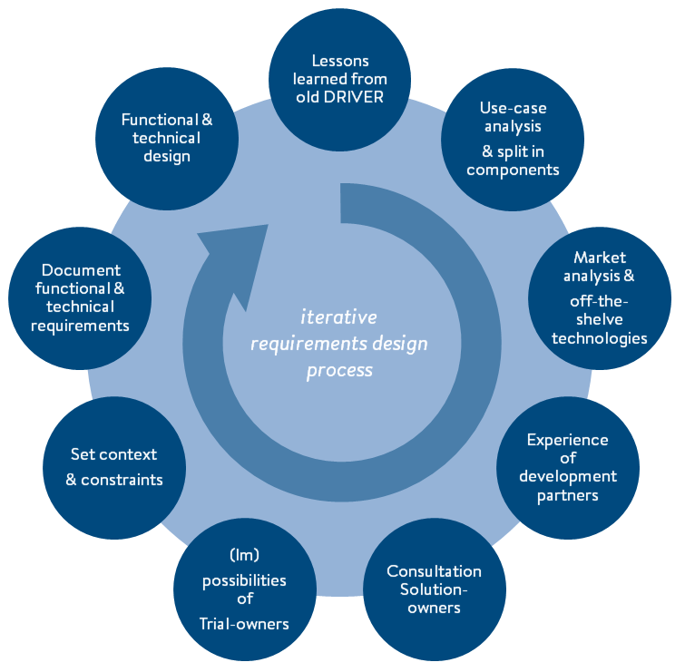

# 2. Work-process used to come up with the Test-bed specifications

This chapter explains the process used to draft the functional requirement specifications, which are documented in this deliverable. This iterative requirements design-process was used by the Test-Bed’s core-development organisations \(FRQ, TNO and XVR\) and by the other development and review partners \(AIT, ITTI and THS and AIT; GMV, JRC and WWU\).

The process followed is not an exact copy of a single, specific design or software-development method, but is based on the generic agile software development method, currently used by many software-developers worldwide. This agile process encompasses multiple parallel design and development efforts going on at the same time. Experts of different domains \(e.g. functional designer vs. software developers, or organisation creating component A vs. organisation developing component B\), work on their own component and meet regularly to discuss the overall architecture and links between these components. The WP-leader \(i.e. TNO\) maintains an overview over all components and the high-over architecture of the entire Test-bed and thereby actively steers the requirements design process.

_Figure 2.1: Iterative process used for setting the Test-Bed's specifications_

The iterative requirements design process followed is visualized in figure 2.1. The following 9 steps can be distinguished in this process, but note that the order of these steps stated here differs in each round the iterative process is followed:

**I.    ** The design process is started by gathering **lessons learned from the former DRIVER**. The experience of partners involved in Task 932.1 that has participated in former DRIVER experiments have been taken into account.T The outcomes are documented in the [next chapter](lessons-learned.md#Lessons-learned).

**II.    **The **high-level use-cases** of the entire Test-bed are considered. This quickly led to the fact that the **Test-bed is split up in multiple components**, due to the different functionalities of these components and to be able to divide the work amongst multiple development partners.

**III.    **For each component \(and functional/technical sub-component\) a **market research** is done about what is already available off-the-shelf, to prevent development efforts are wasted on designing and making everything from scratch while there is a sufficiently functioning component available. Sometimes these components can be directly included in the Test-bed \(e.g. open source Kafka technology\), sometimes parts are re-used from the old DRIVER \(e.g. partly the CIS architecture and base technologies\) and sometimes only the functional design is reviewed \(e.g. the NATO exercise management tool JEMM\) and references are made to such products/technologies.

**IV.    **Next to off-the-shelf components and technologies, also the **experiences of development partners** in similar projects are used to draft the Test-bed’s specifications. For instance the Observer Module, as made by Middlesex University, Netherlands Aerospace Laboratory and XVR in the FP7-project CRISIS, served as a source of design input for the Test-bed’s Observer Support Tool \(see paragraph 5.8 \).

**V.    **Other **Solution owners** within the D+ consortium are **consulted** regarding technical link-abilities, as one of the primary functions of the Test-bed is to let Solutions \(i.e. software tools\) digitally link up with the Test-bed to exchange information in between these Solutions and with other components. Next to Solution-owners included in the D+ consortium, also potential external Solution providers are considered, both because each Trial’s call for solutions is open to externals and because of the required sustainability of the Test-bed.

**VI.    **Similarly like consulting Solution-owners, the **possibilities and impossibilities at Trial-owners** are also reviewed. The Test-bed must be able to function at all Trial-owners included in the D+ consortium. For the Test-bed’s sustainability outside the D+ project it must also be relatively easy to implement the Test-bed at other locations.

**VII.    **Steps IV, V and VI together define the **context and constraints** in which the Test-bed must be able to function. Next to the characteristics of the environment the Test-bed is implemented in \(e.g. computer hardware can be located indoors and does not have to be packed weather-proof\), this contextual description also provides a set of constraints on the Test-bed \(e.g. Test-bed’s core must be able to function without a high-end full-time available internet connection, as some Trial-owners cannot guarantee this availability 24/7 at their site\).

**VIII.    **All these requirements \(i.e. in detail a **set of functional and technical requirements and wishes**\) are documented. This documentation forms this deliverable D923.11. As know-how about the Test-bed's components and their functioning grows during development of these components and the use of them during Trials, D923.11 is a living document which is updated whenever specifications are changed or elaborated.

**IX.    **The drafting of these requirement specifications is done in parallel with the **functional and technical design**. These design and the specification efforts highly influence each other. So although design decisions are documented in D923.21/D923.22/D923.23 Reference Implementation, both these steps forms an integral part of the requirements specification process.

This circular process of documenting the functional specifications is followed many times. When viewed from a distance, this process is followed during four main phases:

1. This process was followed already by the core D+ development partners, who also participated in the former DRIVER. Their experiences and ideas on improvements were were agreed upon and documented in the WP923 description in the DOW. This resulted in the main concepts behind the new Test-bed. 
2. At start of WP923, the core development partners TNO, XVR and FRQ had face-to-face and remote specification and design meetings, going through all of the Test-Bed’s components, what they are intended for, how they are linked and the high-over functional and technical design of them. The outcomes were documented in the meetings’ minutes.
3. Following these high-level specification and design meetings, both internal meetings and face-to-face and remote meetings with other component developers were organised. The high-level specifications and designs were shared and these were then further detailed and documented in component specific documentation \(see also Chapter 5\).
4. During the development of each component, the specifications and designs are further detailed and updated. This phase will continue when the Test-Bed is used in Trials. The outcome of this phase are the components and updates on the living documents.

